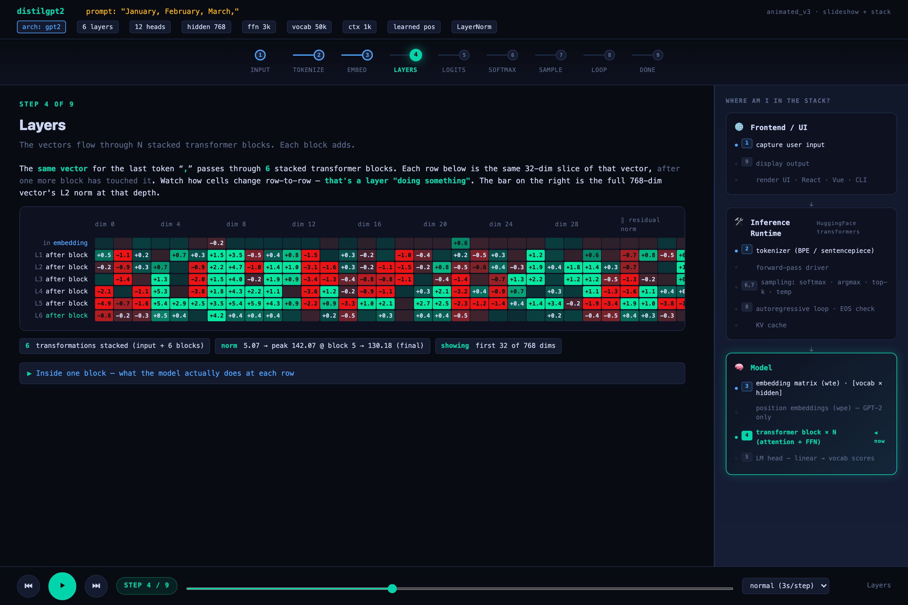
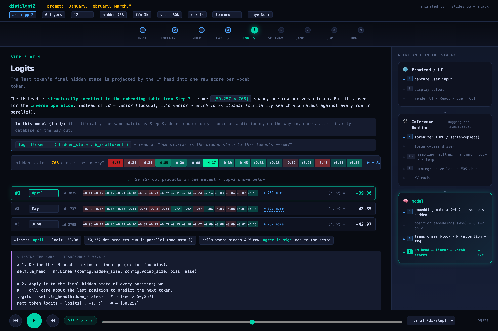
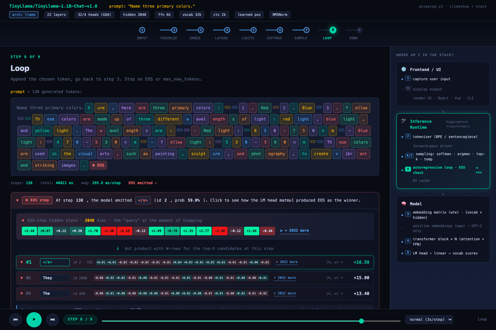
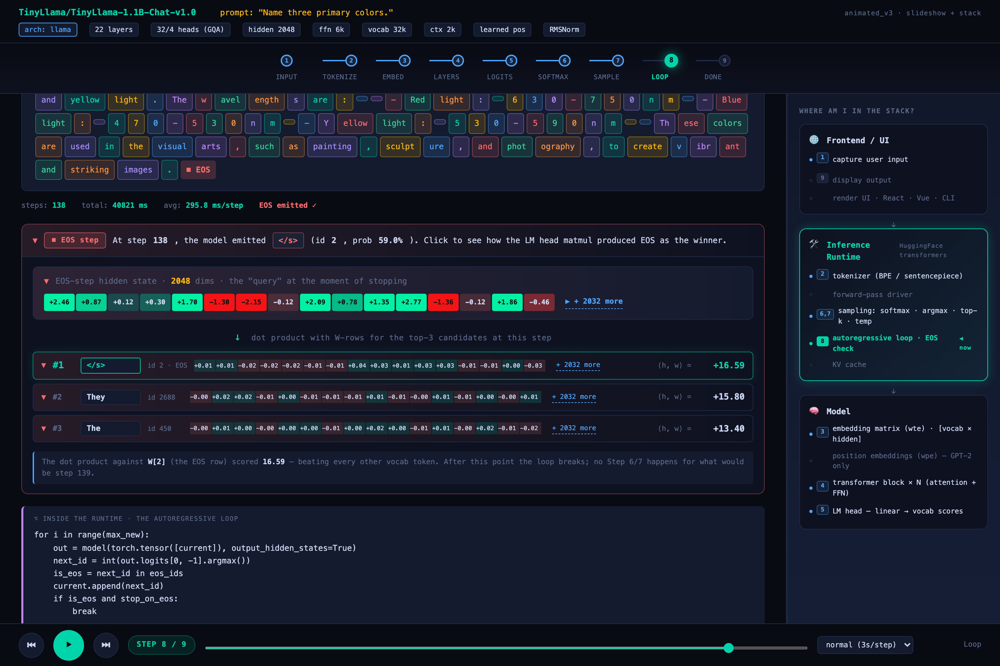

# llm-basics

Step-by-step animated visualization of how a language model turns a prompt into the next token. Built on HuggingFace `transformers` (no inference servers, no abstractions hidden) so every layer, hidden state, attention pattern, logit, and probability is captured and renderable as standalone HTML.

The point: demystify "the model is just a function over learned weights". Each step in the pipeline shows the actual numbers the model is operating on, for the actual prompt you ran.

## Live demos

Hosted on GitHub Pages: **https://kiriz.github.io/llm-basics/**

- **[distilgpt2 — "January, February, March,"](https://kiriz.github.io/llm-basics/distilgpt2-january-february-march.html)** — 6-layer GPT-2 base model completing a sequence
- **[TinyLlama — "Name three primary colors."](https://kiriz.github.io/llm-basics/tinyllama-name-three-primary-colors.html)** — 22-layer chat-tuned Llama answering a question
- **[Embedding-space scatter (distilgpt2)](https://kiriz.github.io/llm-basics/embeddings-distilgpt2.html)** — PCA projection of all 50,257 vocab tokens
- **[Embedding-space scatter (TinyLlama)](https://kiriz.github.io/llm-basics/embeddings-tinyllama.html)** — same, for TinyLlama's 32,000 vocab

## What the demo shows

Each animated demo walks through 9 steps:

1. **Input** — the raw prompt string
2. **Tokenize** — text → integer ids (BPE / sentencepiece)
3. **Embed** — id → 768/2048-dim vector via the embedding table
4. **Layers** — residual-stream evolution through stacked transformer blocks
5. **Logits** — final hidden state projected by the LM head into one score per vocab token
6. **Softmax** — logits → probabilities
7. **Sample** — pick one token (argmax for greedy)
8. **Loop** — repeat until EOS or max tokens
9. **Done** — final output text

A right-side "where am I in the stack?" panel shows whether each step happens in the **frontend**, **inference runtime** (HuggingFace transformers), or **model** (the weights themselves).

## Highlights

Step 4 — **residual stream evolution through layers**. Each row is the same last-token vector after one more transformer block. The norm bar on the right shows how much "magnitude" each layer adds.



Step 5 — **LM head as similarity search**. The final hidden state gets dot-producted against every vocab token's W-row in parallel; top-3 candidates shown with their actual W-row vectors and logit scores.



Step 8 — **the autoregressive loop**. 138 generated tokens (TinyLlama answering "Name three primary colors.") with the prompt in muted gray and EOS as a red chip at the end.



Step 8, expanded — **the matmul that emits EOS**. At step 138 the model picked `</s>` (logit +16.59) over `They` (+15.80) and `The` (+13.40). Click any candidate row to see all 2048 dims of the W-row that made it the winner.



## Run it locally

Requires `uv` (https://astral.sh/uv) and a working Python 3.11+.

```bash
./setup.sh                                          # install deps + warm up distilgpt2
./try-prompt.sh "Apple is round and"                # run any prompt through distilgpt2
./try-prompt.sh "Hi" --model TinyLlama/TinyLlama-1.1B-Chat-v1.0 --max 60
```

Output HTMLs go to `./out/`. Re-run with the same prompt + model: cache hit, no model load.

## Layout

```
src/llm_trace/         # the package
  cli.py               # typer CLI: run | render | list-cache | clear-cache
  collector.py         # loads model, runs forward pass, captures intermediates
  cache.py             # disk cache (.npz arrays + .json sidecar, atomic writes)
  trace_data.py        # TraceData dataclass — torch-free, the spine of the data model
  config.py            # YAML config loader
  embeddings.py        # standalone embedding-space PCA explorer
  renderers/           # pure TraceData → output (no torch imports allowed)
    terminal.py        # rich-formatted terminal output
    png.py             # matplotlib summary plot
    html.py            # static HTML renderer
    animated_v3.py     # the slideshow demo (the highlighted artifact)

tests/llm_trace/       # unit + integration tests
docs/                  # GitHub Pages content (the rendered demos)
trace.yaml             # default config (models, prompts, generation params)
setup.sh               # one-time install via uv
try-prompt.sh          # one-shot prompt → animated HTML
```

## Why HuggingFace transformers

We bypass higher-throughput runtimes (vLLM, TGI, llama.cpp) on purpose. They optimize for serving and hide intermediates. The `transformers` Python forward pass exposes `output_hidden_states` and `output_attentions` directly — that's what makes step-by-step visualization possible.

## License

MIT.
